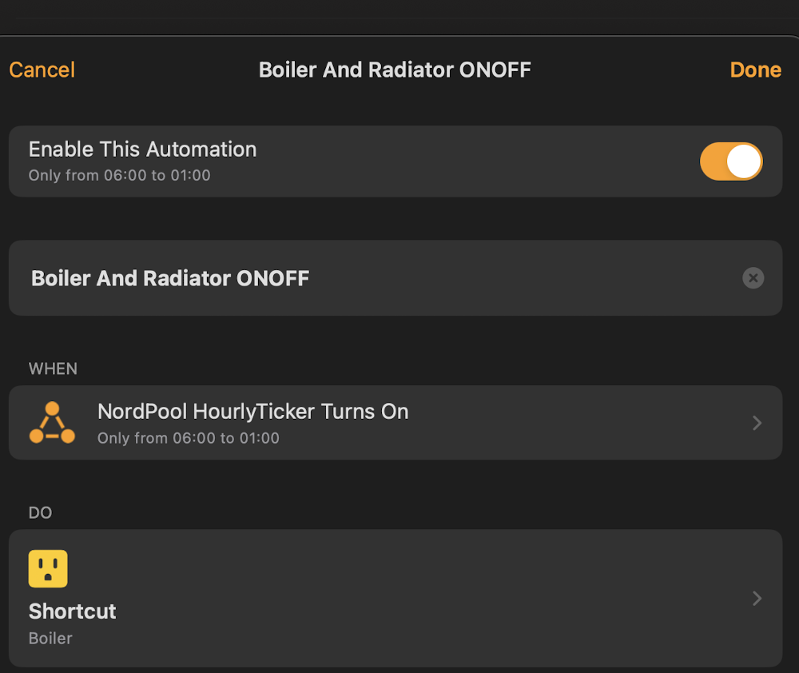
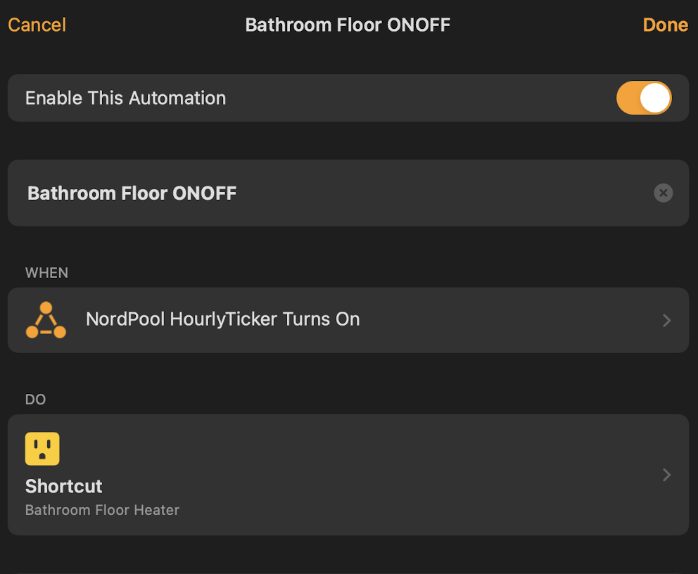
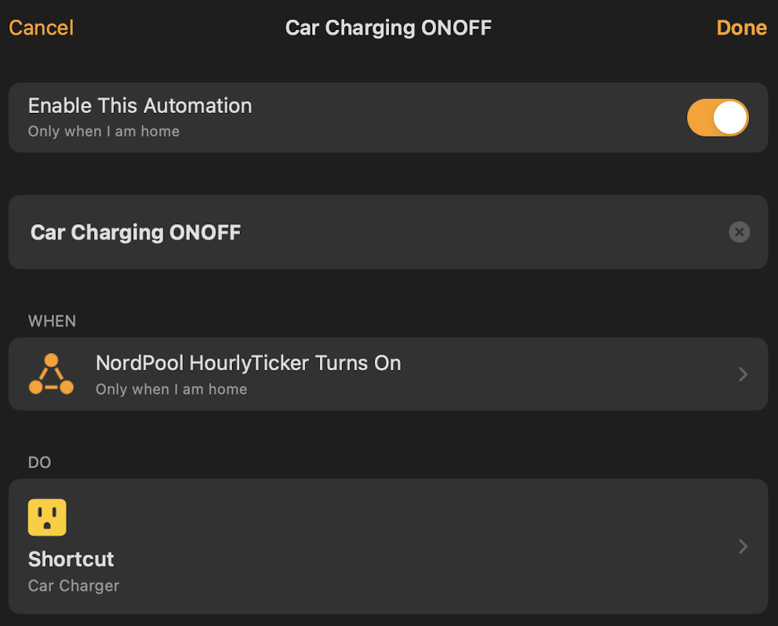
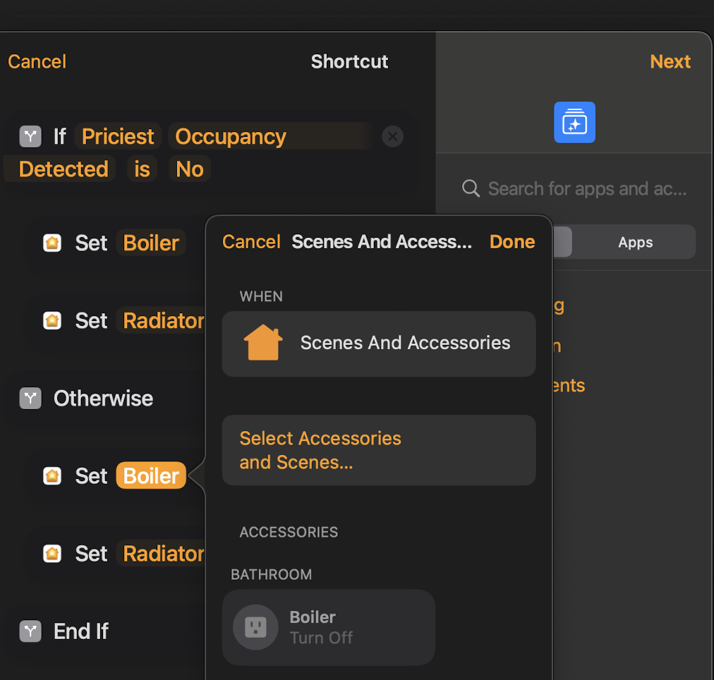
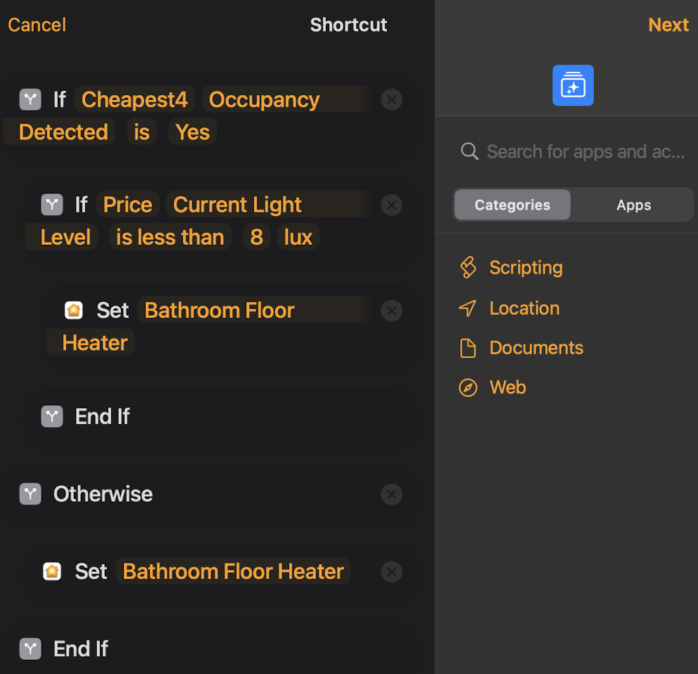
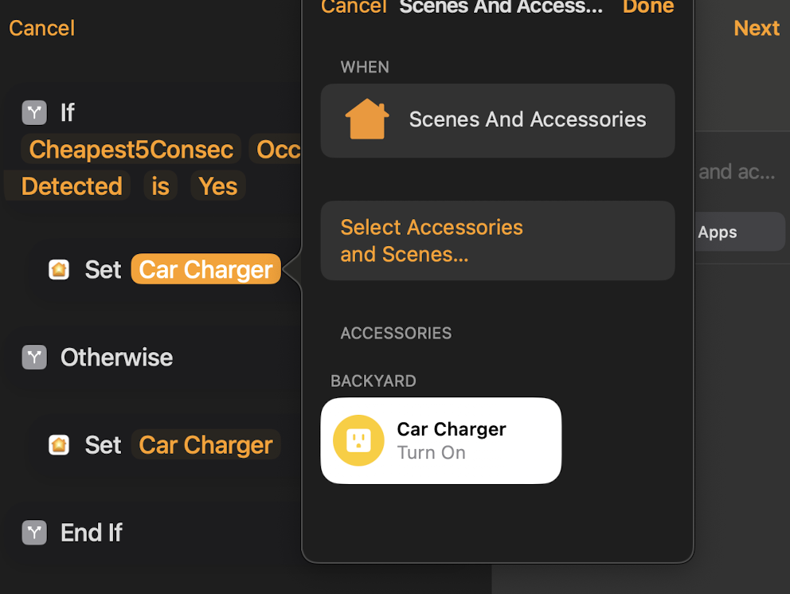

# homebridge-nordpool-baltics #

This plugin allows you to automate electricity-intensive appliances and devices based on Nordpool's price levels. These can include:

- Water heaters (a.k.a boilers)
- Heating systems (such as radiators)
- Car charging
- Power-walls (to balance electricity costs)

Currently, this plugin supports the following Nordpool areas:

- Lithuania
- Latvia
- Estonia
- Finland

## Exposed Accessories ##

It exposes a few 'virtual' accessories that facilitate versatile HomeKit automation based on Nordpool prices. These include:

1. `Nordpool_hourlyTickerSwitch`: A switch that cycles ON and OFF every hour. Use it in 'An Accessory is Controlled' event on HomeKit automation. Then check for desired price/levels further on automation logic;

1. `Nordpool_currentPrice`: A Light Sensor indicating the current hour's electricity price in Euro cents. Scale: 1 LUX = 1 cent;

1. `Nordpool_cheapestHour`: Motion Sensor goes into 'motion detected' state if current hour electricity price ranks cheapest in the day. There can be more than one cheapest hours in the event of repeated same-price occurrences;

1. `Nordpool_cheapest4Hours` to `Nordpool_cheapest8Hours`: A series of Motion Sensors which trigger a 'motion detected' state when the current hour's electricity price ranks among the cheapest of the day. The count can exceed the specified number in the event of repeated same-price occurrences;

1. `Nordpool_cheapest5HoursConsec`: This Motion Sensor triggers during the 5 consecutive lowest-priced electricity hours of the day, ensuring energy-intensive appliances operate uninterrupted for a stretch of 5 hours at the most cost-effective rate;

1. `Nordpool_priciestHour`: A Motion Sensor which triggers 'motion detected' when the current hour's electricity price is the most expensive of the day or exceeds configurable median margin (default 200%). This is typically more than one hour during the day.

## Important Remark About Timezones ##

For accurate hour-to-price matching, it's important that the timezone of your homebridge system (the host) aligns with the timezone of the chosen Nordpool area. If there is a mismatch, the plugin will emit a warning in the log.

Additionally, please verify that your system's clock is regularly synchronized to ensure consistent and accurate hour-to-price ticking.

## HomeKit Automation Examples ##

Here are a few automation examples, based on real-life use cases. Please note, the names of the accessories from the `homebridge-nordpool-baltics` plugin have been renamed in these examples to improve readability.

| Water heater | Floor heater | Car charging |
| --------- | --------- | --------- |
|  |   |    |
|   |   |   |

Do you have a fantastic use case with accessories from the `homebridge-nordpool-baltics` plugin? Share it using [this form](https://github.com/msegzda/homebridge-nordpool-baltics/issues/new).
