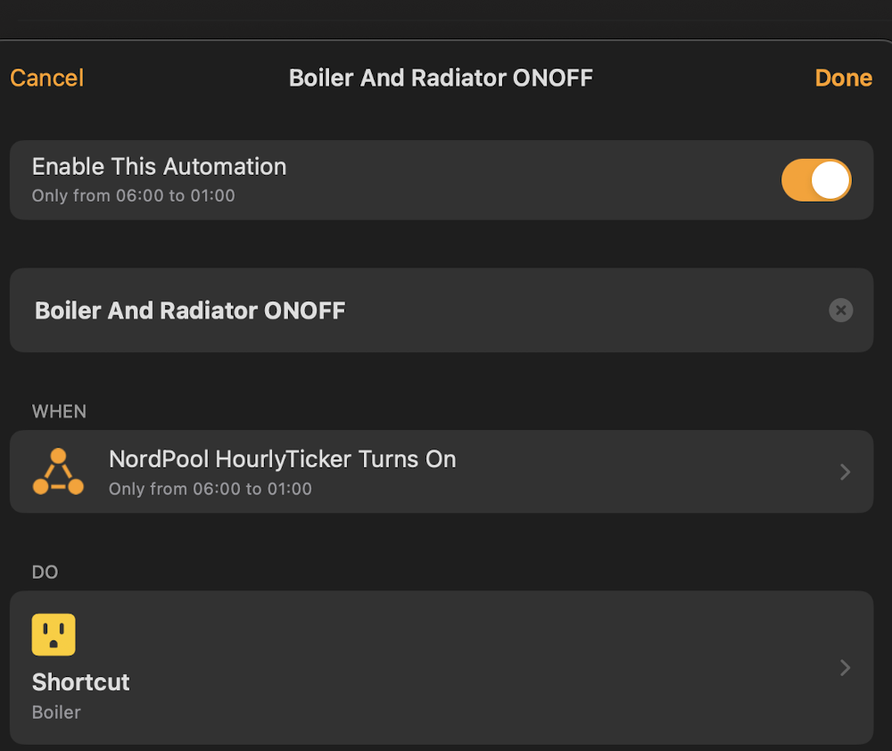
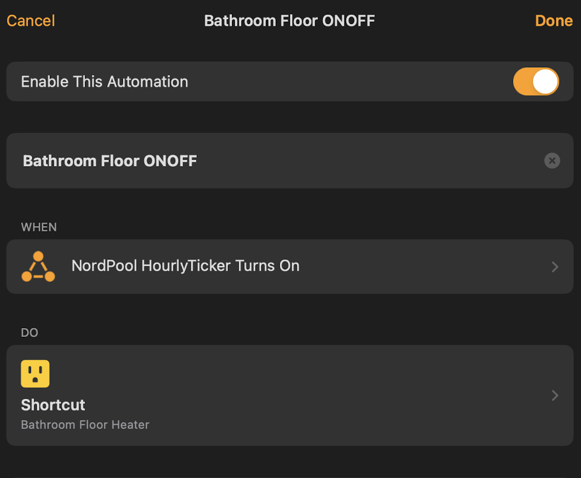
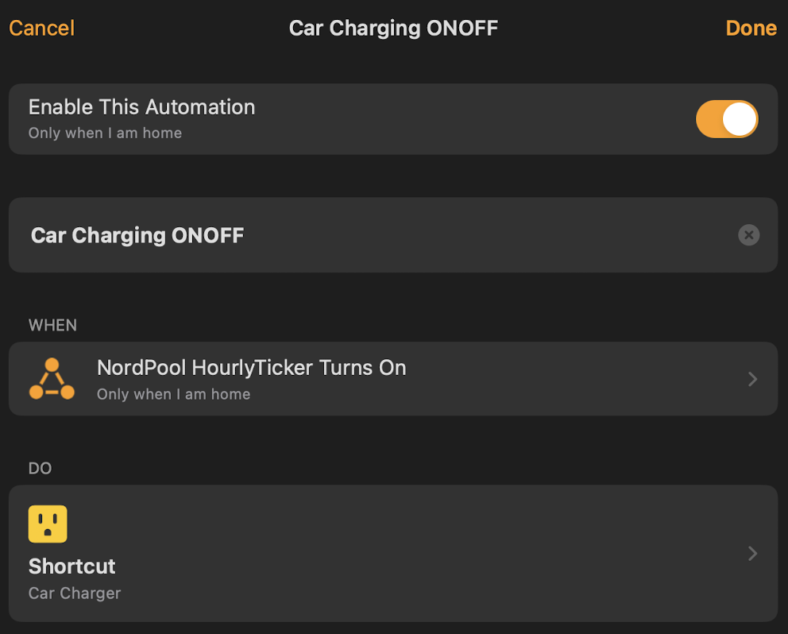
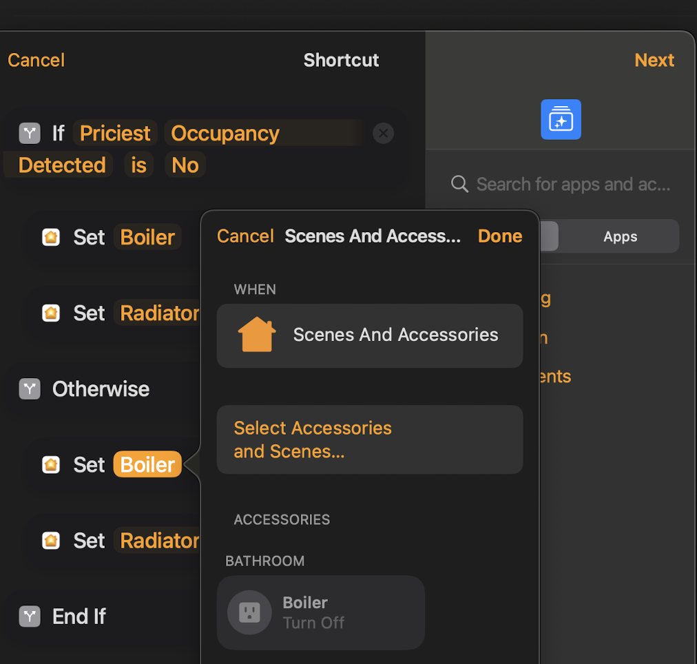
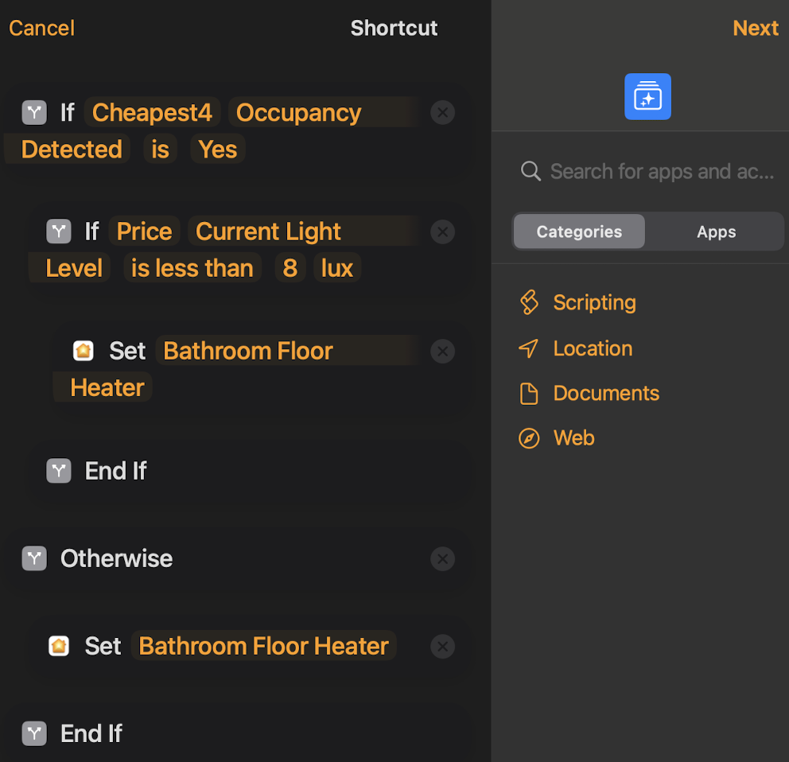
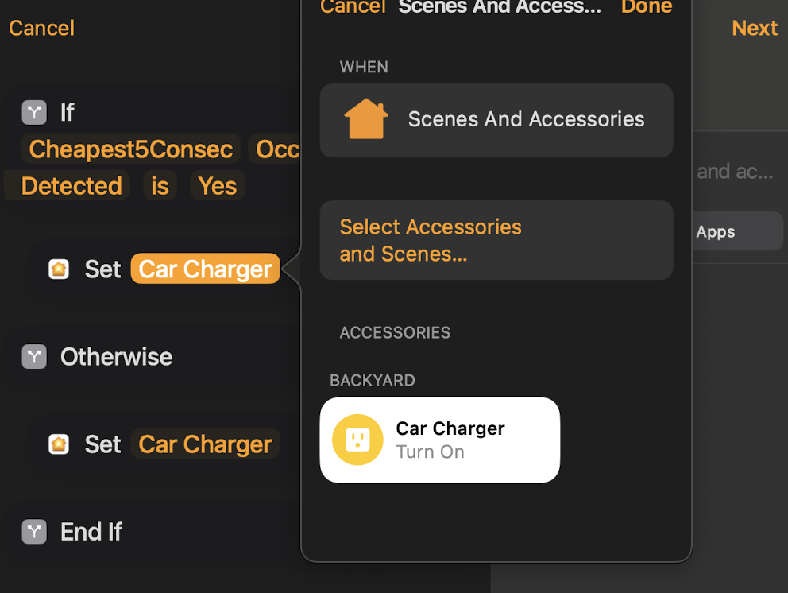

# homebridge-nordpool-baltics #

⚡⚡ Important Update: Nordpool 15-minute pricing intervals averaging now in effect. [Please read more details here](#nordpool-15-minute-pricing-intervals).

If your electricity is billed based on hourly rates through a smart meter, this plugin enables you to automate power-intensive appliances in accordance with Nordpool's pricing levels. For example, this could apply to:

- Car charging
- House heating or cooling devices
- Power-wall (to balance electricity costs)
- Washer-dryer
- Water heater (a.k.a boiler)

Currently, this plugin supports the following Nordpool electricity market areas:

- Lithuania
- Latvia
- Estonia
- Finland
- Sweden (SE1, SE2, SE3, SE4)
- Denmark (DK1, DK2)
- Norway (NO1, NO2, NO3, NO4, NO5)
- Germany
- Luxembourg

## How To Install ##

First, complete the [Homebridge setup](https://homebridge.io/how-to-install-homebridge). Next, install the `homebridge-nordpool-baltics` plugin by using the Homebridge Plugins Manager.

## Available Accessories ##

Plugin exposes the below described 'virtual' accessories:

1. `Nordpool_hourlyTickerSwitch`: A switch that cycles ON and OFF every hour. Use it in 'An Accessory is Controlled' event on HomeKit automation. Then check for desired price/levels further on automation logic;

1. `Nordpool_currentPrice`: A Light Sensor representing the current hour's average electricity price in cents (1 LUX = 1 cent). Due to HomeKit limitation, the minimal value is 0.0001, even if the actual price is 0 or negative.

1. `Nordpool_cheapestHour`: Motion Sensor goes into 'motion detected' state if current hour average electricity price ranks cheapest in the day. There can be more than one cheapest hours in the event of repeated same-price occurrences;

1. `Nordpool_cheapest4Hours` to `Nordpool_cheapest12Hours` (optional on Plugin Config): A series of Motion Sensors which trigger a 'motion detected' state when the current hour's average electricity price ranks among the cheapest of the day. The count can exceed the specified number in the event of repeated same-price occurrences;

1. `Nordpool_cheapest5HoursConsec` (optional on Plugin Config): This Motion Sensor triggers during the 5 consecutive lowest-priced electricity hours ensuring energy-intensive appliances can operate uninterrupted for a stretch of 5 hours. Note more details about its [calculation below](#cheapest-consecutive-hours-calculation-logic).

1. `Nordpool_priciestHour`: This Motion Sensor triggers 'motion detected' when the following conditions are met:
    - Current hour price is most expensive of the day;
    - OR current hour price is within 10% difference from most expensive hour;
    - OR current hour price exceeds configured 'Excessive Price Margin Above Median' value (default 200%);
    - AND all of above exceeds configured 'Minimum Price Threshold for Priciest Hour(s)' value (default 0).

1. `Nordpool_currentHour` (DEPRECATED, optional on Plugin Config): Temperature sensor (possible values 0-23) denoting current hour of the day (24h format). Eliminates 'current hour' scripting needed on HomeKit rules. As of 2025-10-01 this virtual accessory is considered deprecated. Convert your automations to use built in `Current Date->Time` variable instead.

## HomeKit Automation Examples ##

Here are a few automation examples, based on real-life use cases. Please note, the names of the accessories from the `homebridge-nordpool-baltics` plugin have been renamed to improve readability.

| Water heater | Floor heater | Car charging |
| --------- | --------- | --------- |
|  |  |  |
|  |  |  |

## Cheapest Consecutive Hours Calculation Logic ##

Motion sensor `Nordpool_cheapest5HoursConsec` calculation logic is the following:

### If 'Dynamic Cheapest Consecutive Hours' is **Disabled** in Plugin Config ###

- **At 00:00 (midnight)**: Recalculated using the pricing information of the new day.

### If 'Dynamic Cheapest Consecutive Hours' is **Enabled** in Plugin Config ###

- **At 18:00 (6PM)**: If the cheapest 5 consecutive hours occurs later in the evening, the computation includes 0AM-6AM period from the next day. This could potentially *shift* the 5-hour period of cheapest price from the evening to the next day's early morning, aiming for maximum cost efficiency.

- **At 00:00 (midnight)**: If the 6PM run did not result in a *shift*, it will recalculate as normal using the pricing information of the new day.

- **At 07:00 (7AM)**: If the 6PM run *shifted* the 5-hour period, a recalculation happens considering the remaining pricing information of the current day.

## If You Own Solar Power Plant ##

If you own solar power plant and it covers all of your household needs during specific daytime hours in month of June then configure the plugin accordingly.

Enable relevant checkbox and configure your solar plant latitude ([locator here](https://www.latlong.net/)). Then plugin will automatically calculate best solar yield hours in the months of March-September (inclusive). During best solar yield hours Nordpool price is overridden to 0.

## Important Remark About Timezones ##

For accurate hour-to-price matching, it's important that the timezone of your homebridge system (the host) aligns with the timezone of the chosen Nordpool area. If there is a mismatch, the plugin will emit a warning in the log.

Additionally, please verify that your system's clock is regularly synchronized to ensure consistent and accurate hour-to-price ticking.

## Nordpool 15-minute Pricing Intervals ##

Starting on 2025-10-01 Nordpool has switched to 15-minute pricing intervals. This plugin now provides **hourly average prices** to maintain full backward compatibility with your existing automations.

To recap, this plugin now:

- **Averages** the four 15-minute prices within each hour
- **Continues** automations on a **per-hour basis**
- **Ensures** seamless backward compatibility with your existing setups
